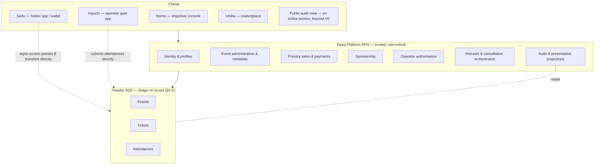
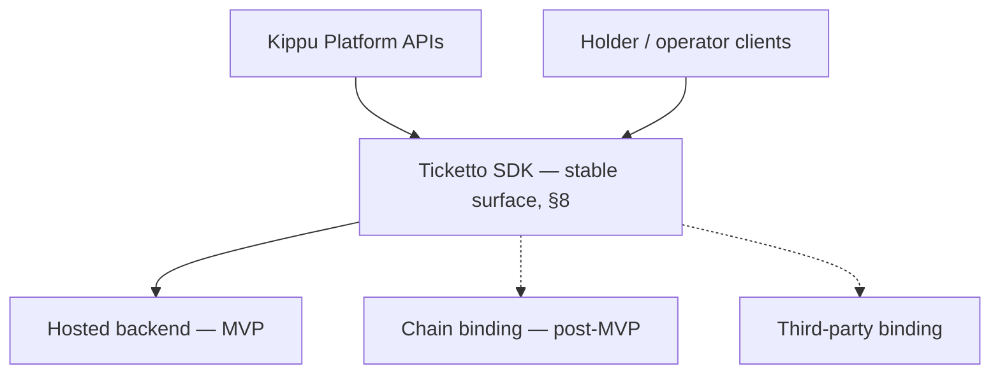

# Kippu — System Specification

## 0. How to read this document

This is a **spec-driven development (SDD)** artifact. It is the single source of
truth for *what* Kippu does and *why*. It deliberately contains no
implementation detail: no database schemas, no framework choices, no
chain-specific code, no wire formats, and no cryptographic constructions. Those
belong to a downstream `PLAN.md` and the per-feature `tasks.md`, each of which
MUST trace every unit of work back to an identifier defined here.

It does fix **architecture** — notably the layer boundaries of §4 and the
backend capabilities of `REQ-SDK-3` — because those are the decisions that
determine whether the boundaries of §4.2 survive contact with code.

Identifier namespaces:

| Prefix | Meaning |
|---|---|
| `US-*` | User story |
| `AC-*` | Acceptance criterion (scoped to its story) |
| `REQ-*` | Normative system requirement |
| `INV-*` | Invariant that MUST hold at all times |
| `ERR-*` | Named error condition |
| `NFR-*` | Non-functional requirement |
| `OQ-*` | Open question. One that blocks a V0 story or requirement MUST be closed before V0's spec freeze; any other MUST be closed before v1.0.0 |
| `DEF-*` | Explicitly deferred scope |

The key words MUST, MUST NOT, SHOULD, SHOULD NOT, and MAY are to be interpreted
as described in RFC 2119.

Where this specification diverges from `PROTOCOL.md` v1.0.0-draft.0, the
divergence is marked **[EXTENDS PROTOCOL]** and carries a rationale. Those
divergences are candidates for upstream contribution to `kippurocks/ticketto`.

---

## 1. Purpose and scope

### 1.1 Problem

Event ticketing is a trust problem wearing an administration problem's clothes.
The parts that need trust — *is this ticket real, who owns it right now, has it
already been used, may it be resold* — are today enforced by the same
centralised operator who profits from the answer. The parts that do not need
trust — venue addresses, seat maps, marketing copy, refund policy, invoices —
are dragged along with them into the same closed system.

Kippu separates the two.

### 1.2 The separation

**Ticketto (the ledger layer)** is the *minimum* set of facts that must
eventually be trustless, public, and impossible for any single party — Kippu
included — to forge or revise:

- that an event exists, and which account owns it;
- that a ticket exists, which event it belongs to, and who holds it;
- under what rules that ticket grants access;
- whether that ticket has been used, and how many times;
- whether it may be transferred or resold, and the atomic execution of both.

Who controls an organiser's account is not among these facts: it is a custody
matter, and Kippu resolves it (§7.G). A holder's account is controlled by the
holder alone (`REQ-SP-4`).

This layer is **not a blockchain in the MVP**. It is an SDK with a pluggable
backend (§4.3). The facts above, their invariants, and their interfaces are
specified as if trustless from day one; *which backend enforces them, and how
strongly, is a deployment decision*. §4.4 states exactly which guarantees are
real under each backend — this specification does not claim trustlessness the
MVP does not deliver.

**Kippu (platform APIs)** is everything else: how tickets are initially sold
and paid for, who the organiser is as a legal person, what the venue looks
like, which staff member may operate a gate tonight, what a refund is worth,
who gets an invoice. This layer MAY be trusted because — *once the ledger layer
runs on a decentralised backend* — nothing it controls can invalidate, forge,
or seize a ticket. Until then the separation is architectural rather than
enforced, which §4.4 states in full.

**Clients** render the above for four audiences: organisers (**Ibento**),
holders (**Saifu**), entrance operators (**Iriguchi**), and the public (audit
view, unnamed — `OQ-11`).

### 1.3 Why this trade-off

Four consequences follow, and they are the point of the design:

1. **Kippu can fail without holders losing their tickets.** If the platform
   disappears, tickets remain valid, ownable, transferable, and resellable
   through any other Ticketto client. *(Fully realised only under a
   decentralised backend — §4.4.)*
2. **Kippu can move fast where it matters commercially.** Pricing models,
   promotions, fiat rails, tax handling, and refund policy change often and
   need no consensus; putting them on-chain would freeze them.
3. **The protocol stays small enough to be auditable.** Every command added to
   the ledger is a permanent liability. The spec below adds exactly one concept
   to `PROTOCOL.md` (event status) and removes several from the ledger's
   concern (price, sale listings for primary issuance, operator identity).
4. **The chain decision is deferred without being foreclosed.** Building the
   ledger layer as an SDK lets Kippu validate real usage before paying the cost
   and irreversibility of a chain, while keeping every interface, invariant,
   and client flow ready for one. This is a deliberate sequencing choice, and
   §4.5 states what must be true for the swap to actually work later.

### 1.4 In scope

This specification covers the behaviour of all three layers and the contracts
between them.

### 1.5 Out of scope

See §12 (Deferred) and §13 (Non-goals).

---

## 2. Glossary

| Term | Definition |
|---|---|
| **Event** | A gathering, physical or virtual, whose existence, ownership, and zones are ledger facts. |
| **Ticket** | A right of access to an event, whose existence, holder, and rules are ledger facts. |
| **Attendance** | A recorded, timestamped use of a ticket to gain access to an event. |
| **Attendance policy** | The rule governing how many times, and until when, a ticket may be used. |
| **Access pass** | A short-lived, holder-signed assertion that the holder wishes to use a specific ticket for entry now. Presented at a gate, typically as a QR code. |
| **Deferred transfer** | Transfer of a ticket to a party who does not yet hold an account, completed when that party claims it (§5.6). |
| **Sponsor** | The Kippu-controlled ledger account that bears ledger costs on behalf of users, and holds only the limited rights of `REQ-SP-2`. |
| **Holder credential** | Whatever lets a holder authorise ledger actions for their account: a keypair, a device-bound credential such as a passkey, or another mechanism the cryptographic profile defines. Where this specification says a holder's *key*, it means their credential. |
| **Restriction** | A per-ticket flag disabling resale or transfer. |
| **Listing** | A holder's ledger-recorded offer to sell a ticket at a stated price. |
| **Primary sale** | The first sale of a ticket, from organiser to first holder. Handled entirely by Kippu. |
| **Hold** | A Kippu-side reservation of a ticket's issuance during a primary sale. Not a ledger fact. See §7.H. |
| **Ledger** | The system of record for everything assigned to Ticketto in §4.2, whatever backend implements it. |
| **Backend** | A concrete implementation of the ledger behind the Ticketto SDK — hosted (MVP) or chain (post-MVP). See §4.3. |
| **Assurance level** | Which §9 invariants a given backend enforces rather than attests. See §4.4. |
| **Saifu** | The holder client. Holds keys, signs access passes, transfers, trades. |
| **Ibento** | The organiser console. Events, classes, issuance, capacity, operators. |
| **Iriguchi** | The operator gate client. Scans and validates access passes; requires connectivity. |
| **Ichiba** | The marketplace client. Discovery and sale of tickets, primary and secondary. |
| **Face value** | The price at which a ticket was originally sold on the primary market. Kippu-held; not a ledger fact. |
| **Ticket class** | An organiser-defined category of ticket with its own policy, restrictions, quota, and provenance. See §5.4. |
| **Provenance** | Whether a ticket was `Purchased` (paid for) or `Granted` (issued free). Determines what restrictions are permissible. See §5.2. |
| **Guest ticket** | Any ticket of `Granted` provenance — press, staff, artist guest, sponsor, companion. Always free. |
| **Capacity proof** | A validated attestation that a venue supports a stated capacity. Required for any capacity increase. See §5.1. |
| **Zone** | A named part of an event, either *seated* or *unseated*. See §5.5. |
| **Placement** | A ticket's place within its zone: a position in a seated zone, or a discriminator in an unseated one. Part of the ticket's identity. See §5.5. |
| **Secondary sale** | Any subsequent sale, holder to holder. Handled by Ticketto. |

---

## 3. Actors

| Actor | Layer it primarily touches | Holds a ledger account? |
|---|---|---|
| **Organiser** | **Ibento** | Yes — owns their events; Kippu exercises its authority (§7.G) |
| **Holder** | **Saifu** | Yes — owns their tickets |
| **Attendee** | **Saifu** | Yes (a holder presenting a pass) |
| **Entrance operator** | **Iriguchi** | No — authorised by Kippu (§7.E) |
| **Promoter** | Kippu APIs | Deferred (`DEF-1`) |
| **Venue owner** | Audit view, Kippu APIs | No |
| **Buyer / reseller** | **Ichiba** to discover, **Saifu** to sign | Yes |
| **Claimer** | **Saifu** | Yes, created at claim time |
| **Sponsor** | Kippu platform, internal | Yes — platform-controlled |
| **Public auditor** | Audit view *(unnamed — `OQ-11`)* | No |

> **Note on the sponsor.** `PROTOCOL.md` leaves the "ticket issuer" participant
> commented out while relying on it in every sequence diagram. This spec names
> it **sponsor**, assigns it to Kippu, and defines its powers and limits
> explicitly in `REQ-SP-*`.

---

## 4. Architecture

### 4.1 Layers



#### Client surfaces

| Name | Audience | Role | Talks directly to the SDK? |
|---|---|---|---|
| **Saifu** | Holders, attendees, buyers, claimers | Holds tickets, signs access passes, transfers, lists, buys, claims | **Yes** — holds the signing key (`REQ-CL-1`) |
| **Ibento** | Organisers | Creates and administers events, issues tickets, manages guest lists, operators, capacity, cancellation | No — via Kippu, which exercises organiser authority (§7.G) |
| **Iriguchi** | Entrance operators | Scans and validates access passes, admits; requires connectivity | Submits passes; authorised by Kippu (§7.E) |
| **Ichiba** | Buyers, browsers, resellers | Discovery and sale of tickets — both primary and secondary (§7.F) | Reads listings; **cannot sign** (`REQ-MP-4`) |
| *(Ichiba section)* | Venue owners, promoters, public | Read-only audit projections — beyond V0 (§15) | Read-only |

*Ichiba* (市場, marketplace) is a working name — see `OQ-16`.

**`REQ-CL-2`** **Saifu** is the only client that holds a holder's signing key.
**Ibento** and **Iriguchi** MUST NOT have access to holder keys, and MUST NOT
be able to act as a holder. This is what keeps `REQ-OP-2` true: an operator app
is a *submitter* of passes it cannot forge.

**`REQ-CL-4`** **Ichiba** is a commerce surface, not a custody surface. It
MUST NOT hold keys, sign on a holder's behalf, or execute a ledger transfer.
Secondary purchases are handed off to **Saifu** for signature (`REQ-MP-4`).

**`REQ-CL-3`** **Iriguchi** requires connectivity to validate and admit, and
MUST NOT admit on a verdict it could not obtain online. It submits attendances
through the SDK without Kippu in the submission path (`REQ-OP-2`).

> **Trade-off, stated plainly.** A venue without connectivity cannot run gates.
> That is deliberate: offline admission let over-use, stale holders, and revoked
> operators through with nothing but a flag afterwards, and a venue can provide
> a reliable uplink or a private mesh network — as large events already do — far
> more cheaply than the system can make offline admission safe. Holders, who
> suffer most from congested mobile data, stay offline-capable (`NFR-3`).

### 4.2 Responsibility allocation

The table below is normative. A capability MUST NOT be implemented at a layer
other than the one named.

| Capability | Layer | Rationale |
|---|---|---|
| Event existence, ownership, capacity, zones | Ticketto | Must be unforgeable |
| Event status (active/cancelled/finished) | Ticketto | Determines ticket validity |
| Event name, description, venue, seat map, imagery | Kippu | Changes freely; no trust required |
| Ticket existence, holder, attendance policy, restrictions | Ticketto | Must be unforgeable |
| Attendance record | Ticketto | Must be tamper-evident and single-use |
| Access-pass verification | Ticketto | Must not depend on a trusted verifier |
| Primary sale, pricing, checkout, fiat, tax, invoicing | Kippu | Commercial logic, changes often |
| Secondary listing, price, atomic sale | Ticketto | Must not require buyer and seller to trust each other |
| Transfer and deferred transfer | Ticketto | Must survive Kippu's absence |
| Operator authorisation and shift management | Kippu | Organisational, revocable, not a trust anchor |
| Ledger costs | Kippu (as sponsor) | Users must not need to hold a ledger balance (`REQ-SP-1a`) |
| Refund calculation and disbursement | Kippu | Money outside the ledger |
| Public audit projections | Kippu (derived from Ticketto) | Convenience over the ledger of record |
| Choice of ledger backend | Kippu (deployment) | See §4.3; invisible to every other row |

### 4.3 The Ticketto SDK and its backends

**This is the central architectural decision of the MVP.**

`PROTOCOL.md` is written against Substrate primitives (`pallet-nfts`,
`pallet-assets`, `do_*` internal APIs). Kippu does **not** adopt them yet. The
Ticketto layer is delivered as an **SDK**: a single, stable, chain-free API
surface implementing all the behaviour in §8, backed by a swappable
**ledger backend**.



**`REQ-SDK-1`** The SDK surface MUST be identical across backends. Swapping a
backend MUST require no change to Kippu or to any client.

**`REQ-SDK-2`** No backend-specific type, identifier format, error, or concept
(block height, gas, extrinsic, transaction hash, wallet vendor) may appear in
the SDK surface. Backends translate; callers never see through.

**`REQ-SDK-3`** The SDK composes exactly four capabilities, and nothing in §8
may require more than these. Three are supplied by the **backend**; the fourth,
`Signatures`, is supplied by the **cryptographic profile** (`REQ-CP-1`) and is
not a backend concern:

| Capability | What Ticketto needs from it |
|---|---|
| `Registry` | Record an event, its owner, and its zones; record a ticket against an event under its identity; change a ticket's holder; record and read the ledger facts of §5; encumber a ticket against transfer. |
| `Value` | Settle a stated price from buyer to seller, atomically with the change of holder. What a price denominates is `OQ-5` and `OQ-8`. |
| `Clock` | A monotonic current timestamp agreed by all parties to the backend. |
| `Signatures` *(profile, not backend)* | Verify that a payload was authorised by the credential controlling a given account. |

**`REQ-SDK-4`** Accounts and signatures are the **cryptographic profile's**
concern (§4.6), supplied to the SDK and invisible to the backend. For a given
profile, credential provisioning, the canonical representation of an access
pass, and signature verification MUST work identically under every backend — including
the MVP one. The gate's security model (§7.E) therefore does not change when
the backend changes.

**`REQ-SDK-5`** Every state-changing SDK call MUST produce an append-only,
ordered log record, and the log MUST be verifiable by a party that did not
produce it. The verification mechanism is defined by the cryptographic profile
(`REQ-CP-1`). The log is the backend-independent audit trail and the basis of
migration (§4.5).

**`REQ-SDK-6`** A backend MUST declare, in machine-readable form, which
invariants of §9 it enforces and which it merely attests
(§4.4). Kippu MUST surface this to holders as the ticket's *assurance level*.

**`REQ-SDK-7`** Every backend MUST pass a shared conformance suite exercising
every invariant in §9 and every error in §10 raised by the ledger's rules
before production use (`NFR-8`).
The suite is written once against the SDK surface, not per backend.

**`REQ-SDK-8`** *Withdrawn by amendment 0002. Tolerance of backend latency is required
by `NFR-9`; how the SDK surface expresses write completion is a plan-level
decision.*

**`REQ-SDK-9`** Ledger state MUST NOT be writable other than through the SDK,
and Kippu's business layer MUST have no path to ledger state other than the
SDK. Sharing a store with Kippu's own application database is the single
easiest way to violate this unnoticed, and to make the ledger layer
un-swappable.

### 4.4 Trust model per backend — stated plainly

The invariants in §9 are the SDK's contract under *every* backend. What differs
is **who is able to violate them and what stops them**. This table is the
honest version of the architecture, and it MUST be kept accurate.

| Guarantee | Hosted backend (MVP) | Chain binding (post-MVP) |
|---|---|---|
| Ticket authenticity (`US-F2`) | **Attested** by Kippu | **Enforced** cryptographically |
| Holder cannot be dispossessed (`REQ-FR-1`) | **Attested** — an operator with database access could violate it | **Enforced** — no key can |
| Attendance monotonic (`INV-3`) | **Attested** | **Enforced** |
| Double-use prevention (`INV-6`) | **Enforced** (single authority; in fact *easier* than on-chain) | Enforced |
| Atomic sale (`INV-7`) | **Enforced** (single transaction boundary) | Enforced, harder |
| Survives Kippu's disappearance (`US-C5`) | **Not delivered** | Delivered |
| Public auditability (`US-F1`) | **Partial** — Kippu-published, tamper-evident log (`REQ-TM-3`) | Delivered |
| Holder signature gates entry (`US-E1`) | **Enforced** | Enforced |
| Pass presented within its validity window (`US-E1`) | **Attested** by the submitter | **Attested** by the submitter |
| Organiser controls their event (`REQ-OA-1`) | **Custodied** by Kippu | **Custodied** by Kippu |

**`REQ-TM-1`** Stories `US-C5` and `US-F2`, and criteria `AC-A2.2` and
`AC-F2.1`, are **conditionally satisfied**: their interfaces and client flows
ship in the MVP, their guarantees do not. `PLAN.md` MUST NOT mark them done on
the basis of MVP delivery.

**`REQ-TM-2`** Kippu MUST NOT market, describe, or imply trustless,
tamper-proof, or decentralised properties for tickets issued under a backend
that merely attests them. Overclaiming here is both a product risk and a
consumer-protection one.

**`REQ-TM-3`** Under a backend that attests rather than enforces (§4.4), Kippu
MUST publish the `REQ-SDK-5` log in a form third parties can retain, such that
any later revision of history they already hold is detectable by them without
Kippu's cooperation. Under a backend that enforces the invariants of §9, the
backend discharges this obligation. It is the substitute for public
verifiability available before `DEF-6`, and what makes retroactive fraud
detectable rather than merely deniable.

> **Trade-off, stated plainly.** Deferring the chain buys validated demand
> before irreversible cost, and it is the right call for an MVP. What it costs
> is the entire trust proposition of §1.3 — for MVP users, Kippu *is* the
> trusted party the protocol exists to remove. `REQ-TM-1`–`REQ-TM-3` exist so
> that this is a known, bounded, temporary position rather than a quiet one.

### 4.5 Keeping the swap real

An abstraction is only swappable if something forces it to stay so. The
following are requirements, not aspirations. Epic G states what a migration
must deliver to holders, organisers, and auditors; the requirements below state
what the SDK must make possible. A deployment runs on one backend at a time
(`INV-15`): migration moves it from one to the next, and is never concurrent
operation.

**`REQ-MG-1`** A second backend MUST exist from early in the MVP, independent
of the first, and MUST pass the conformance suite (`REQ-SDK-7`). A single
implementation always leaks.

**`REQ-MG-2`** Identifiers MUST be backend-independent and stable across
migration. A ticket's identity MUST NOT be derived from backend-specific data.

**`REQ-MG-3`** The SDK MUST support exporting complete ledger state and
importing it into another backend, producing identical observable state.

**`REQ-MG-4`** Migration MUST carry every existing event across without
disturbing it: an event, its tickets, and everything recorded about them MUST
remain usable through and after migration, with no action required of
organisers or holders.

**`REQ-MG-5`** The SDK MUST NOT expose any operation that a chain binding could
not implement — notably: no arbitrary state mutation, no deletion of
attendances, no rewriting of history, no unbounded queries. It is trivially
easy to build a hosted backend that a chain can never replace; these are the
specific temptations to refuse.

**`REQ-MG-6`** Migration MUST preserve holder keys, or provide a specified
re-attestation path. Holders MUST NOT lose control of a ticket by migrating.

### 4.6 The cryptographic profile

The SDK depends on cryptographic and encoding choices: how accounts are
identified, how a holder authorises an action, and how identities are
represented. Fixing them in the SDK makes the choice un-revisable
without a spec change; devolving them to the backend makes a holder's key
change when the backend does, which `REQ-MG-6` forbids. Both are avoided by
naming the bundle and varying it independently of both.

**`REQ-CP-1`** A deployment MUST name exactly one **cryptographic profile**: a
versioned definition of every cryptographic and encoding choice the SDK depends
on — at minimum, how accounts are identified, how a holder's authorisation is
produced and verified, and the canonical representation of anything that is
authorised or that identifies a ticket.

**`REQ-CP-2`** The SDK MUST be profile-agnostic. No profile-specific type,
scheme name, key length, or encoding may appear in the SDK surface. A profile
is supplied to the SDK as a capability, exactly as a backend is (`REQ-SDK-3`).

**`REQ-CP-3`** A backend MUST NOT determine, constrain, or observe the profile
in force. Profile and backend vary independently; this is what makes
`REQ-MG-6` satisfiable without re-attestation, and it is why `Signatures` is
listed in `REQ-SDK-3` as a profile capability rather than a backend one.

**`REQ-CP-4`** *Withdrawn by amendment 0002 — subsumed by `REQ-ID-1`, which defines a
ticket's identity solely by public components, so no secret input is
possible.*

**`REQ-CP-5`** Every profile MUST pass the conformance suite (`REQ-SDK-7`)
against every backend. The suite is parameterised by profile; the matrix is
profiles × backends.

**`REQ-CP-6`** An account MAY have more than one registered credential, and any
of them MAY authorise for it. The first registration creates the account; each
further registration MUST be authorised by a credential already registered to
that account. A holder with a second device can therefore keep control of their
tickets after losing one — the only recovery V0 offers (`DEF-7`).

> **Trade-off, stated plainly.** The conformance matrix grows with each
> profile, and a deployment cannot change profile without a migration event.
> That is the price of the SDK holding no opinion. Hardcoding one scheme is
> cheaper today and is precisely the decision that would have to be unpicked at
> `DEF-6`. V0 names exactly one profile (`OQ-21`, closed); this section stays
> because it is how the credential model can change later.

## 5. Domain model

Types below are written in a Rust-like notation for legibility and carry no
implementation language. **Field names bind** where a requirement says so — see
`REQ-TK-1`. **Widths, numeric types, and syntax do not bind**: `Count` below
means "a count", and no invariant in §9 implies a bit width.

### 5.1 Event

```
Event {
    id:            EventId
    owner:         AccountId          // the organiser
    status:        EventStatus
    max_capacity:  Option<Capacity>   // [EXTENDS PROTOCOL] — see REQ-EV-3
    issued:        Capacity           // count of tickets issued
    zones:         Set<Zone>          // see §5.5
}

EventStatus {                          // [EXTENDS PROTOCOL] — see §14, OQ-1
    Active,       // default on creation; tickets may be issued and used
    Sealed,       // no further issuance; existing tickets remain fully valid
    Cancelled,    // terminal; tickets may no longer be used or traded
    Finished,     // terminal; no ledger state of the event or its tickets may change (INV-16)
}
```

**`REQ-EV-11`** The permitted status transitions are `Active → Sealed`,
`Active | Sealed → Finished`, and `Active | Sealed → Cancelled`. No other
transition exists (`AC-A5.6`); any other status change MUST fail with
`ERR-InvalidTransition`.

**`REQ-EV-12`** `Finished` is set by the organiser, through Kippu (`REQ-OA-1`).
Kippu MAY set it automatically on the organiser's behalf. Nothing on the ledger
sets it by time: because `Finished` freezes all ledger state (`INV-16`), a timer
could freeze a multi-day event, or a ticket whose policy is still valid.

**`REQ-EV-3`** `max_capacity` is OPTIONAL. **[EXTENDS PROTOCOL]** A capacity
bound is meaningful for a seated concert and meaningless
for an open-ended membership or a virtual conference. When absent, issuance is
unbounded. When present, it bounds *issuance*, not simultaneous presence
(`INV-4`).

#### Capacity is mutable, asymmetrically

Capacity changes in real life — a room is reconfigured, a balcony is closed.
But capacity is also the primary lever for **overselling**, which the system
exists in part to make impossible. So the two directions are not symmetric.

```
set_event_capacity(event, new_capacity, proof?) -> Result<()>
```

**`REQ-EV-4`** **Decreasing** capacity is always permitted, down to — but never
below — the number of tickets already issued. Attempting to set a capacity
lower than `issued` MUST fail with `ERR-CapacityBelowIssuance` (`INV-11`).
Tickets already in holders' hands are never invalidated by an organiser
shrinking their event.

**`REQ-EV-5`** **Increasing** capacity MUST require a **capacity proof**: an
attestation that the venue actually supports the higher figure. Without a
validated proof the increase MUST fail with `ERR-CapacityProofRequired`.

**`REQ-EV-6`** Capacity proofs are validated by Kippu, not by the ledger. The
ledger records *that* an increase was authorised and the identifier of the
proof that authorised it; it does not evaluate fire-safety certificates. The
proof artefact itself is Kippu-held (`NFR-6` — it will contain venue and
possibly personal data, and MUST NOT be written to the ledger). Validation is a
Kippu operations review; Kippu retains the artefact and the identity of the
reviewer. A capacity proof is therefore procedural and attested, not enforced.

**`REQ-EV-7`** Removing a capacity bound entirely (setting `max_capacity` to
none on an event that had one) counts as an increase and MUST require a proof.

**`REQ-EV-8`** Capacity MUST NOT change while the event is `Sealed`,
`Cancelled`, or `Finished`.

> **Threat addressed.** Overselling by capacity inflation: an organiser
> raising capacity to sell more tickets than the venue holds. The mitigation is
> deliberately *procedural at the platform and recorded at the ledger* — the
> ledger cannot know what a venue holds, but it can make every increase
> attributable to a named, validated authorisation, which is what makes the
> fraud provable after the fact rather than deniable.

#### Identity and cancellation

**`REQ-EV-9`** An `EventId` MUST be assigned by the Ticketto layer, never
allocated by the backend, and MUST be unchanged by migration (`REQ-MG-2`).
Because a backend may be shared by more than one Kippu deployment and by other
Ticketto clients, an `EventId` MUST be unique across every party that could
share the backend, not merely within one deployment.

**`REQ-EV-10`** Cancelling an event MUST fix, as a ledger fact, the holder of
every ticket of that event at the moment of cancellation. That set MUST NOT
change afterwards, whatever transfers follow (`AC-A5.4`). *Fix* means
determinable from ledger state alone and immutable; it need not mean copying
every holder in one operation, which a chain binding could not do for a large
event.

### 5.2 Ticket

```
Ticket {
    id:            TicketId          // deterministic — see §5.5
    event:         EventId
    holder:        AccountId
    class:         ClassId           // see §5.4 — defined in Kippu, referenced here
    provenance:    Provenance        // how the ticket entered circulation
    zone:          ZoneId            // see §5.5
    placement:     Placement         // see §5.5
    policy:        AttendancePolicy
    restrictions:  TicketRestrictions
    attendances:   Count
    listing:       Option<Listing>
    pending_claim: Option<PendingClaim>
}

Provenance {
    Purchased,   // acquired through a primary sale — the holder paid
    Granted,     // issued free of charge: guest list, press, staff, comp
}

AttendancePolicy {
    Single,
    Multiple  { max: Count, until: Option<Timestamp> },
    Unlimited { until: Option<Timestamp> },
}

TicketRestrictions {
    cannot_resale:   bool,
    cannot_transfer: bool,
}

Listing {
    price: Price,    // what a price denominates is OQ-5 and OQ-8
}
```

**`REQ-TK-1`** The canonical restriction field names are `cannot_resale` and
`cannot_transfer`. `PROTOCOL.md` uses these in its type definition and
`restrict_resell` / `restrict_transfer` in its sequence diagrams; this
specification treats the latter as a documentation defect (`OQ-4`).

**`REQ-TK-2`** `cannot_transfer` implies `cannot_resale`. A ticket that cannot
change hands gratis cannot change hands for money.

#### Restrictions are bound to provenance, not to organiser discretion

Resale is a **promise Kippu makes to buyers**, not a setting an organiser
grants them. If an organiser could mark a sold ticket non-resellable, the
promise would be worth nothing and the platform's central value proposition
would evaporate one event at a time. So the flags are not freely settable.

**`REQ-TK-3`** A ticket with `provenance: Purchased` MUST have
`cannot_resale: false` and `cannot_transfer: false`, always. Any attempt to
issue or modify such a ticket with a restriction set MUST fail with
`ERR-RestrictionNotPermitted` (`INV-12`). **A paid ticket is always resellable
and always transferable** — until its event is `Finished`, when every ticket
freezes alike (`INV-16`).

**`REQ-TK-4`** Only tickets with `provenance: Granted` MAY carry restrictions.
Whether they do is a property of their **class** (§5.4) — a press pass may be
non-transferable, a staff pass non-resellable, an artist guest-list ticket
freely transferable but never resellable. The organiser configures the class;
the class determines the ticket.

**`REQ-TK-5`** Provenance is immutable. A ticket MUST NOT change from `Granted`
to `Purchased` or back. Otherwise `REQ-TK-3` is trivially circumventable.

**`REQ-TK-6`** Restrictions MAY only ever be *removed*, never added, after
issuance (`INV-10` is hereby tightened in this direction). An organiser may
free a guest ticket for transfer; nobody may retroactively encumber a ticket a
holder already owns.

> **This reverses `PROTOCOL.md`'s default.** The draft treats restrictions as a
> free organiser choice at issuance (`maybe_restrictions`). Here, the default
> for anything sold is *unrestricted and unrestrictable*, and restriction is
> available only on the free-of-charge path.

### 5.3 Access pass

**[EXTENDS PROTOCOL]** — `PROTOCOL.md` has `mark_attendance(origin, event,
ticket)`, in which the *attendee* is the caller. That cannot express gate
control: it lets a holder mark their own attendance from a bus stop, and gives
an operator no way to act. The access pass replaces it.

**`REQ-AP-1`** An access pass MUST be producible only by a ticket's holder.
Validation by the ledger MUST fail, with `ERR-InvalidPass`, for a pass not
produced by the ticket's holder at the time the ledger records it. A gate's
admission before the ledger records the attendance is provisional
(`REQ-OP-3`).

**`REQ-AP-2`** A pass MUST designate exactly one ticket and MUST NOT be usable
against any other.

**`REQ-AP-3`** A pass MUST be valid only within a bounded window (`NFR-5`), and
MUST fail with `ERR-PassExpired` outside it.

**`REQ-AP-4`** A pass MUST be consumable at most once (`INV-6`). Distinct passes
for the same ticket MUST be distinguishable from one another, so that a holder
of a multi-use ticket presenting a fresh pass is never refused as a replay.

**`REQ-AP-5`** A pass MUST be producible without connectivity (`NFR-3`).
Validating one requires connectivity (`REQ-CL-3`). Whether offline production
can be made safe against leakage is open (`OQ-24`).

How a pass achieves these — its fields, encoding, and uniqueness — is defined
by the cryptographic profile (`REQ-CP-1`).

The pass is produced by the holder's client, presented at a gate (typically as
a QR code), and submitted to the protocol by whoever is operating that gate.
Its validity depends on the holder's authorisation, not on the submitter's
identity — which is precisely why operator authorisation can live outside the
ledger (§7.E).

### 5.4 Ticket classes

A guest list is not one list. Press, artist guests, staff, sponsors, VIPs, and
accessibility companions differ in what they may do with the ticket, when it is
valid, and how many exist — and none of them are the same as a paying
attendee's ticket.

**`REQ-TC-1`** An organiser MUST be able to define **multiple, independently
configurable ticket classes** per event. There is no single unified guest list.

**`REQ-TC-2`** A class definition is a **Kippu** concept and lives off-ledger:
its name, description, quota, issuance rules, and internal approval workflow
are administrative. What reaches the ledger is only the class *identifier* and
the ledger-relevant facts it determines: attendance policy, restrictions, and
provenance. The identifier is **opaque**: without Kippu, a client can tell a
guest ticket from a paid one by its provenance, policy and restrictions, but not
which guest class it belongs to (`DEF-10`).

**`REQ-TC-3`** Every class MUST declare its provenance — `Purchased` or
`Granted` — and that declaration MUST be consistent with `REQ-TK-3`. A class
declared `Purchased` MUST NOT declare restrictions; Kippu MUST reject such a
class at definition time rather than at issuance time.

**`REQ-TC-4`** Granted-class tickets MUST be issued with **no payment flow of
any kind** — no transaction, no zero-value charge, no invoice. Free means free
at every layer, including the absence of a payment record.

**`REQ-TC-5`** Classes MAY carry a quota. A class quota bounds issuance within
that class; the event's `max_capacity` bounds issuance across all classes
(`INV-4`). Guest tickets count against capacity — a room does not care whether
a body paid.

> **Note.** Some venues account for staff and press outside the public
> capacity figure. A per-class exemption is deferred (`DEF-9`).

### 5.5 Ticket identity and zones

**[EXTENDS PROTOCOL]** — `PROTOCOL.md` leaves `TicketId` to the ledger's
allocator. That allows the same seat to be issued twice: overselling by double
allocation.

An event is divided into **zones**, each either seated or unseated, so that one
event can mix numbered stands with general admission. Zone names and seat maps
are Kippu metadata (§4.2); a zone's identity and kind are ledger facts.

```
Zone {
    id:   ZoneId,
    kind: ZoneKind,
}

ZoneKind { Seated, Unseated }

Placement {
    Seated   { position: Position },            // a seat designation within the zone
    Unseated { discriminator: Discriminator },  // unique within the zone
}
```

**`REQ-ID-1`** A `TicketId` is determined **solely** by the event, the zone,
and the ticket's placement within that zone, and by nothing else — not class,
provenance, holder, policy, price, or metadata. Two issuances with equal
identity components are the same ticket. The identity MUST be caller-supplied
and MUST NOT be allocated by the backend. Its canonical representation is
defined by the cryptographic profile (`REQ-CP-1`).

**`REQ-ID-2`** The ledger MUST reject issuing a `TicketId` that already exists,
with `ERR-TicketIdExists`. For a seated zone this makes double-allocation of a
position **structurally impossible** rather than merely policed: the second attempt
collides with the first and fails, in the ledger, regardless of what Kippu
believes.

> **What this does not prevent.** The ledger rejects a second ticket for the
> same position *designation*. That designations correspond one-to-one with
> physical seats — no aliases, no invented seats — is Kippu's responsibility
> (`REQ-ID-3`) and is attested rather than enforced, under every backend.
> Capacity (`INV-4`) remains the backstop against invented seats.

**`REQ-ID-3`** **Derivation is Kippu's responsibility**, not the ledger's — the
ledger enforces uniqueness over an id it is given, and performs no derivation
of its own: it allocates and chooses no identifier. It MUST, however, reject a
command whose stated `EventId` or `TicketId` is not the profile's canonical
representation of the components the same command states
(`ERR-IdentifierMismatch`); otherwise one placement could be issued under two
ids, and `INV-13` would not hold. Kippu MUST therefore reject seat double-allocation at the platform
layer, before submission, so the organiser gets a comprehensible error rather
than a collision. Defence at both layers is retained and deliberate: the ledger
check is the guarantee, the platform check is the user experience.

> **What this costs.** Nothing in authority: because `REQ-ID-1` defines identity
> solely by public components, any party can recompute a ticket's identity.
> Kippu holding the derivation confers no power to issue the same placement
> twice.

**`REQ-ID-4`** *Withdrawn by amendment 0002 — subsumed by `REQ-ID-1`, which defines
identity by its components rather than by how it is constructed.*

**`REQ-ID-5`** In an unseated zone, the discriminator is chosen by the issuer
and MUST be unique within its zone. It MAY be predictable: enumerating an
event's tickets reveals nothing the ledger does not already make public. Identity
is then unique but carries no
anti-oversell guarantee; there, `INV-4` (capacity) is the only bound, which is
why `REQ-EV-5` matters most for general admission.

**`REQ-ID-6`** Ticket identity MUST be stable across backend migration
(`REQ-MG-2`). Deterministic identity satisfies this for free — a ticket
recomputes to the same id on any backend — and is the reason this design is
preferable to a backend-allocated counter independently of the oversell
argument.

**`REQ-ID-7`** An event's zones, and each zone's kind, are ledger facts. The
ledger MUST reject a ticket whose zone is not defined for its event
(`ERR-UnknownZone`), or whose placement does not match its zone's kind
(`ERR-ZoneKindMismatch`). Zones MAY be added while the event is `Active`. A zone
in which a ticket has been issued MUST NOT be removed (`ERR-ZoneInUse`), and its
kind MUST NOT change. Zones carry no capacity of their own (`DEF-11`). Without
this, unseated-form tickets issued into a seated zone
never collide, and `REQ-ID-2` is bypassed entirely.

> **Threat addressed.** Overselling by double allocation: selling the same seat
> twice. Structurally prevented at the ledger for seated zones; bounded by
> capacity for unseated ones.

### 5.6 Pending claim

```
PendingClaim {
    expires_at: Option<Timestamp>,
    // whatever the cryptographic profile needs to verify a claim — opaque here
}
```

**`REQ-DT-1`** A holder MUST be able to offer a ticket to a party who holds no
account yet. The offer MUST be completable only by a party the holder has
entrusted with the means to claim it, and MUST NOT be completable by anyone
relying solely on what the ledger records.

How a claim is verified is defined by the cryptographic profile (`REQ-CP-1`).

---

## 6. User stories

Each story carries acceptance criteria in Given/When/Then form. Stories are the
unit of traceability: `PLAN.md` and the per-feature `tasks.md` MUST reference them.

### Epic A — Event lifecycle

**`US-A1`** — As an **organiser**, I create an event with an optional capacity,
so that my event exists as a public, ownable object I can issue tickets against.
- `AC-A1.1` Given a valid organiser account, When I create an event, Then an
  event exists in the ledger with me as owner and status `Active`.
- `AC-A1.2` Given I supply no capacity, Then issuance against the event is
  unbounded.
- `AC-A1.3` Given I supply a capacity of *n*, When *n* tickets have been
  issued, Then further issuance fails with `ERR-CapacityExceeded`.
- `AC-A1.4` Given I have no ledger balance, When I create an event, Then Kippu
  sponsors the cost and the event is created regardless (`REQ-SP-1`).

**`US-A2`** — As an **organiser**, Kippu administers my event on the ledger for
me, so that I never handle ledger credentials.
- `AC-A2.1` Given an event created via Kippu, Then its owning account's
  authority is exercised by Kippu on my behalf (`REQ-OA-1`), and the sponsor
  holds only the rights of `REQ-SP-2`.
- `AC-A2.2` Given the sponsor account is compromised, Then it MUST NOT be able
  to seize tickets from holders or alter recorded attendances (`REQ-FR-1`,
  `INV-3`).

**`US-A3`** — As an **organiser**, I describe my event richly — venue, imagery,
schedule, copy — and revise it freely, so that marketing is not a consensus
operation.
- `AC-A3.1` Given an event, When I edit its description, Then no ledger write
  occurs.
- `AC-A3.2` Given a client resolving an event, Then ledger identity and
  platform metadata are presented as one object.

**`US-A4`** — As an **organiser**, I seal my event so no further tickets can be
issued, so that holders and the public can trust the final supply.
- `AC-A4.1` Given status `Active`, When I seal it, Then status is `Sealed` and
  issuance fails thereafter with `ERR-EventSealed`.
- `AC-A4.2` Given status `Sealed`, Then transfer, resale, and attendance all
  continue to work normally.

**`US-A5`** — As an **organiser**, I cancel my event, so that tickets stop
being usable and refunds can be settled fairly.
- `AC-A5.1` Given status `Active` or `Sealed`, When I cancel, Then status is
  `Cancelled`.
- `AC-A5.2` Given status `Cancelled`, When any attendance is attempted, Then it
  fails with `ERR-EventCancelled`.
- `AC-A5.3` Given status `Cancelled`, Then all open listings are void and no
  new listing may be created (`INV-8`) — nobody may sell a ticket to a
  cancelled event.
- `AC-A5.4` Given status `Cancelled`, Then transfer remains permitted, so that
  tickets can still be moved for accounting or collection purposes.
- `AC-A5.5` Given a cancellation, Then Kippu calculates refunds outside the
  ledger — at most once per purchased ticket — and disburses each to the
  ticket's original purchaser, whatever transfers followed. The holder set fixed
  at cancellation (`REQ-EV-10`) is recorded, but in V0 it does not decide who is
  refunded (`DEF-12`).
- `AC-A5.6` `Cancelled` and `Finished` are terminal: no status transition out
  of them exists.
- `AC-A5.7` Given status `Finished`, When any operation that would change the
  event or its tickets is attempted, Then it fails with `ERR-EventFinished`
  (`INV-16`).
- `AC-A5.8` Given a status change not permitted by `REQ-EV-11`, Then it fails
  with `ERR-InvalidTransition`.

**`US-A6`** — As an **organiser**, I adjust my event's capacity as the venue
configuration changes, but I cannot use that to oversell.
- `AC-A6.1` Given `issued = n`, When I set capacity to any value ≥ *n*, Then it
  succeeds.
- `AC-A6.2` Given `issued = n`, When I set capacity below *n*, Then it fails
  with `ERR-CapacityBelowIssuance` and no holder's ticket is affected.
- `AC-A6.3` Given I raise capacity without a validated capacity proof, Then it
  fails with `ERR-CapacityProofRequired`.
- `AC-A6.4` Given I raise capacity with a validated proof, Then the increase
  succeeds and the ledger records which proof authorised it (`REQ-EV-6`).
- `AC-A6.5` Given the event is `Sealed`, `Cancelled`, or `Finished`, Then any
  capacity change fails.

### Epic B — Issuance

**`US-B1`** — As an **organiser**, I issue a ticket bearing an attendance
policy, so that one mechanism serves a single-entry concert, a ten-use fast
pass, and an open-ended membership.
- `AC-B1.1` Given policy `Single`, Then the ticket admits exactly once.
- `AC-B1.2` Given policy `Multiple { max: n }`, Then the ticket admits at most
  *n* times.
- `AC-B1.3` Given policy `Unlimited { until: t }`, Then the ticket admits any
  number of times at or before *t*.
- `AC-B1.4` Given any policy with `until: t`, When entry is attempted after
  *t*, Then it fails with `ERR-TicketExpired`.

**`US-B2`** — As an **organiser**, I define several distinct classes of free
ticket and issue against them, so that press, artists' guests, staff, sponsors
and accessibility companions are each governed by their own rules rather than
lumped into one guest list.
- `AC-B2.1` Given an event, When I define a class, Then I set its name, quota,
  attendance policy, and — for granted classes only — its restrictions
  (`REQ-TC-1`, `REQ-TC-3`).
- `AC-B2.2` Given a granted class, When I issue a ticket from it, Then the
  ticket is free and **no payment flow of any kind occurs** — no transaction,
  no zero-value charge, no invoice (`REQ-TC-4`).
- `AC-B2.3` Given two granted classes with different rules, Then tickets issued
  from each carry their own class's policy and restrictions independently.
- `AC-B2.4` Given a class quota of *n*, When *n* tickets have been issued from
  it, Then further issuance from that class fails, independently of the event's
  remaining capacity.
- `AC-B2.5` Given granted tickets are issued, Then they count against the
  event's `max_capacity` (`REQ-TC-5`).
- `AC-B2.6` Given any issued ticket, Then its class is recorded on the ledger
  and visible to the holder — a press pass is legible as one through Kippu.
  Without Kippu, only its provenance, policy and restrictions are (`REQ-TC-2`).

**`US-B3`** — As an **organiser**, I restrict *free* tickets against resale or
transfer, so that comps and press passes cannot be scalped — while every ticket
someone actually paid for stays freely resellable.
- `AC-B3.1` Given a ticket with `provenance: Purchased`, When anyone — the
  organiser included — attempts to restrict it, Then it fails with
  `ERR-RestrictionNotPermitted`. **A paid ticket is always resellable** until
  its event is `Finished` (`REQ-TK-3`, `INV-12`, `INV-16`).
- `AC-B3.2` Given a granted ticket whose class sets `cannot_resale`, When a
  listing is attempted, Then it fails with `ERR-CannotResell`.
- `AC-B3.3` Given a granted ticket whose class sets `cannot_transfer`, When a
  transfer or deferred transfer is attempted, Then it fails with
  `ERR-CannotTransfer`.
- `AC-B3.4` Given any ticket, When an organiser attempts to add a restriction
  after issuance, Then it fails; removing one succeeds (`REQ-TK-6`).

**`US-B5`** — As a **buyer**, I cannot be sold a seat that has already been
sold to someone else, so that arriving at the venue is not a lottery.
- `AC-B5.1` Given a seated zone and a position already issued, When issuance
  of the same position is attempted, Then it fails at the ledger with
  `ERR-TicketIdExists` (`REQ-ID-2`) — regardless of what the platform believed.
- `AC-B5.2` Given the same attempt, Then Kippu rejects it before submission
  with a comprehensible error (`REQ-ID-3`).
- `AC-B5.3` Given an unseated zone, Then issuance is bounded only by capacity
  (`INV-4`, `REQ-ID-5`).

**`US-B4`** — As a **buyer**, I purchase a ticket from an organiser with an
ordinary payment method and receive it without holding a ledger balance, so
that the ledger is invisible to me.
- `AC-B4.1` Given I have no wallet, When I complete checkout, Then Kippu
  provisions an account, sponsors all costs, and the ticket is issued to me.
- `AC-B4.2` Given checkout, Then no price or listing state is written to the
  ledger — primary sale terms are Kippu's concern alone.
- `AC-B4.3` Given payment fails, Then no ticket is issued and the hold is
  released (`REQ-HD-1`).
- `AC-B4.4` Given two buyers check out the last available ticket or the same
  seat, Then only one obtains a hold, and the other is refused before paying
  (`REQ-HD-3`).

> **Note.** `PROTOCOL.md`'s `issue_ticket` carries `maybe_price` and `for_sale`.
> This specification removes both from the issuance path: primary sales belong
> to Kippu (§4.2). This simplifies ticket instantiation considerably and is the
> single largest reduction of on-chain surface in this design.

### Epic C — Secondary market

**`US-C1`** — As a **holder**, I list my ticket for resale at my own price, so
that I can recover value on a ticket I cannot use.
- `AC-C1.1` Given an unrestricted ticket, When I list it, Then the listing is
  public and the ticket is locked against direct transfer.
- `AC-C1.2` Given a listed ticket, Then I remain its holder until sale.

**`US-C2`** — As a **holder**, I withdraw my listing at any time before sale.

**`US-C3`** — As a **buyer**, I purchase a listed ticket in a single atomic
operation, so that neither side can take the money and keep the ticket.
- `AC-C3.1` Given I can pay the asking price, When I buy, Then funds move to the seller
  and the ticket moves to me, or neither happens (`INV-7`).
- `AC-C3.2` Given I cannot pay the asking price, Then the operation fails with
  `ERR-CannotPay` and nothing moves.
- `AC-C3.3` Given a completed sale, Then the listing is cleared.
- `AC-C3.4` Given a cancelled event, Then purchase fails (`AC-A5.3`).

**`US-C4`** — As an **organiser or venue owner**, I can see and constrain the
secondary market for my event, so that I retain the oversight a centralised
platform would sell me.

**`US-C6`** — As a **buyer**, I browse and buy tickets for an event in one
place, without needing to know or care whether a given ticket comes from the
organiser or from another holder.
- `AC-C6.1` Given an event, When I browse it, Then primary and secondary
  inventory appear together.
- `AC-C6.2` Given any listing, Then it is labelled unambiguously as a primary
  sale or a resale (`REQ-MP-1`).
- `AC-C6.3` Given a resale listing, Then the original face value is shown
  alongside the asking price (`REQ-MP-2`).
- `AC-C6.4` Given I am browsing, Then no account, wallet, or key is required
  (`REQ-MP-7`).
- `AC-C6.5` Given a cancelled event, Then its listings are neither shown nor
  purchasable (`REQ-MP-6`, `INV-8`).

**`US-C7`** — As a **buyer**, buying a resale ticket is as simple as buying a
primary one, without the marketplace ever holding my keys.
- `AC-C7.1` Given a resale listing, When I buy, Then Ichiba hands off to Saifu,
  which signs and submits the purchase (`REQ-MP-4`).
- `AC-C7.2` Given the handoff, Then funds and ticket still move atomically
  (`INV-7`) — the extra surface changes nothing about the guarantee.
- `AC-C7.3` Given Ichiba is compromised, Then it cannot move a ticket, because
  it never had the ability to sign.

**`US-C8`** — As a **reseller**, my listing is visible to buyers wherever they
look, so that listing on-ledger is genuinely worth doing.
- `AC-C8.1` Given I list via Saifu, Then the listing appears in Ichiba without
  further action.
- `AC-C8.2` Given Ichiba filters or ranks listings, Then that is disclosed and
  the full set remains reachable (`REQ-MP-3`, `REQ-MP-5`).

**`US-C5`** — As a **holder**, I can trade my ticket even if Kippu is
unavailable, so that my property does not depend on a company's uptime.
- `AC-C5.1` Given Kippu's business layer is entirely offline, Then listing,
  buying, transferring, and claiming all remain possible via any Ticketto
  client. **Conditional under the MVP backend — see `REQ-TM-1`.**

### Epic D — Transfer and onboarding

**`US-D1`** — As a **holder**, I transfer my ticket to a known account in one
step, with no acceptance required from the receiver.

**`US-D2`** — As a **holder**, I defer a transfer to someone who has no
account yet, with an optional expiry, so that giving a ticket does not require
the recipient to onboard first (`REQ-DT-1`).
- `AC-D2.1` Given a pending claim, Then the ticket is encumbered against other
  transfers and listings (`REQ-CM-2`).
- `AC-D2.2` Given an expiry that has passed, Then a claim fails with
  `ERR-ClaimExpired` and the holder may reclaim the ticket.

**`US-D3`** — As a **claimer**, I claim the ticket after creating my account.
- `AC-D3.1` Given a valid claim, Then the ticket transfers to me.
- `AC-D3.2` Given an invalid claim, Then the claim fails and the pending claim
  remains open.
- `AC-D3.3` Given no account, When I follow a claim link, Then Kippu provisions
  an account and sponsors the claim (`REQ-SP-1`).

**`US-D4`** — As a **holder**, I cancel a pending deferred transfer, so that an
unclaimed ticket is never stranded.

### Epic E — Access at the gate

**`US-E1`** — As an **attendee**, I present a signed access pass at the gate,
so that only I — the holder — can authorise the use of my ticket.
- `AC-E1.1` Given I hold the ticket, When my client produces a pass, Then it is
  signed by my account key and bounded by a short validity window.
- `AC-E1.2` Given a pass signed by a non-holder, Then validation fails with
  `ERR-InvalidPass`.
- `AC-E1.3` Given a pass whose `valid_until` has passed, Then validation fails
  with `ERR-PassExpired`.
- `AC-E1.4` Given a pass already consumed, Then re-submission fails with
  `ERR-PassReplayed` (`INV-6`).

**`US-E2`** — As an **entrance operator**, I check a ticket's validity before
admitting, without changing anything, so that I can turn people away cleanly.
- `AC-E2.1` Given any ticket, When I query it, Then I learn whether it would
  currently admit, and why not if it would not.
- `AC-E2.2` The query MUST be free of side effects.

**`US-E3`** — As an **entrance operator**, my scan records the attendance in
the ledger, so that a single-use ticket cannot be used twice anywhere.
- `AC-E3.1` Given a valid pass, When I submit it, Then attendance increments by
  exactly one.
- `AC-E3.2` Given two operators submit the same pass concurrently, Then exactly
  one succeeds (`INV-6`).
- `AC-E3.3` Given the ticket's allowance is exhausted, Then submission fails
  with `ERR-CannotAttend` and attendance does not change.
- `AC-E3.4` Given two gates validate the same pass before either submission is
  recorded, Then both may admit; the ledger records exactly one (`AC-E3.2`)
  and the other is flagged (`REQ-OP-3`).

**`US-E4`** — *Withdrawn by amendment 0002, with `AC-E4.1`–`AC-E4.4`. Iriguchi does
not operate offline (`REQ-CL-3`).*

**`US-E5`** — As an **organiser**, I authorise specific staff to operate
specific gates for a specific window, and revoke them instantly, so that gate
staff are managed like staff and not like key holders.
- `AC-E5.1` Authorisation is granted, scoped, and revoked entirely within
  Kippu; no ledger state changes.
- `AC-E5.2` Given a revoked operator, Then Iriguchi refuses to admit under that
  operator's authorisation, checked alongside validation rather than in its
  path.
- `AC-E5.3` A rogue operator with a valid pass can, at worst, consume that
  pass's single attendance. They cannot forge, seize, or invalidate tickets.
- `AC-E5.4` *Withdrawn by amendment 0002 — revocation without connectivity no longer
  arises (`REQ-CL-3`).*

### Epic F — Auditability

**`US-F1`** — As a **venue owner or promoter**, I audit issuance, sales, and
attendance for an event from a public source, so that I need not trust the
organiser's reporting.

**`US-F2`** — As **anyone**, I verify a ticket's authenticity without trusting
Kippu, so that forgery is impossible rather than merely detectable.
*(Guarantee deferred to a decentralised backend; interface ships in MVP.)*
- `AC-F2.1` Given only a ticket identifier and public read access to the
  ledger, Then authenticity, holder, policy, and attendance count are all
  determinable. **Conditional under the MVP backend — see `REQ-TM-1`.**

**`US-F3`** — As an **organiser**, I watch attendance in real time, so that I
can manage capacity and queues on the night.

### Epic G — Migration

A deployment runs on one backend at a time (`INV-15`). Migration moves it to
the next, once, and MUST NOT disturb what it carries (`REQ-MG-4`).

**`US-G1`** — As a **holder**, my tickets come through a migration exactly as
they were, so that a change in what runs the ledger never changes what I hold.
- `AC-G1.1` Given a ticket before migration, Then after it the ticket's
  identity, event, holder, class, provenance, zone, placement, policy,
  restrictions, attendances, listing, and pending claim are unchanged
  (`REQ-MG-2`, `REQ-MG-3`).
- `AC-G1.2` Given migration completes, Then I keep control of my ticket —
  without re-enrolling, or through the re-attestation path of `REQ-MG-6`.
- `AC-G1.3` Given the new backend enforces an invariant the old one only
  attested, Then my ticket's assurance level changes accordingly
  (`REQ-SDK-6`), and not before migration completes (`REQ-TM-2`).

**`US-G2`** — As an **organiser**, my events come through a migration without my
involvement, so that a backend change is not my operational problem.
- `AC-G2.1` Given an event before migration, Then after it the event's
  identity, owner, status, capacity, zones, issuance count, and recorded
  capacity authorisations are unchanged.
- `AC-G2.2` Given operations in flight at cutover, Then no operation accepted
  before cutover is lost, and no operation submitted during cutover is silently
  dropped — each is either applied or refused in a way its submitter can retry
  (`OQ-23`).
- `AC-G2.3` *Withdrawn by amendment 0002 — no offline attendance queue exists
  (`REQ-CL-3`).*

**`US-G3`** — As a **public auditor**, I verify that a migration was faithful,
so that a backend change is not an opportunity to rewrite history.
- `AC-G3.1` Given the exported pre-migration state and the post-migration
  state, Then a third party can verify that their observable state is identical
  (`REQ-MG-3`, `NFR-10`).
- `AC-G3.2` Given the `REQ-SDK-5` log, Then it continues across migration
  without gap or rewrite, and history recorded before migration remains
  verifiable after it.

---

## 7. Layer contracts

### 7.A Kippu → Ticketto (sponsorship)

**`REQ-SP-1`** Kippu **always** sponsors any cost the ledger imposes on an
operation, in whatever form the backend imposes it, for **every**
user-initiated operation: account creation, event creation, capacity changes, ticket issuance,
transfer, deferred transfer and claim, listing and withdrawal, and attendance
submission. Sponsorship is unconditional, not a fallback for users who lack a
balance.

**`REQ-SP-1a`** Consequently, **no user of Kippu ever needs to hold a ledger
balance**, and no user-facing flow may present a fee, a gas estimate, a
"top up" prompt, or a funding step. The only funds a user ever moves are the
purchase price of a ticket (`US-C3`).

**`REQ-SP-1b`** Under the MVP backend these costs are nil. The sponsorship path
MUST exist and be exercised anyway, so that enabling a chain binding is a
configuration change rather than a redesign — and so that the cost of that
binding is measurable from MVP volumes before it is committed to (`OQ-7`).

**`REQ-SP-2`** The sponsor MUST hold only the rights needed to relay operations
and bear their costs. Where Kippu exercises organiser authority (`REQ-OA-1`),
issuance is signed with that authority, and the sponsor holds no issuance right:
a second key able to issue would be a second key able to oversell. It MUST NOT hold
rights permitting it to transfer a ticket away from its holder or alter
attendance records (`REQ-FR-1`, `INV-3`).

**`REQ-SP-3`** Sponsorship is an **entitlement, not a credit line**. Every
sponsored operation MUST be attributable to an entitlement — an event owned, a
ticket held, a claim offered — and the sponsorship an entitlement confers MUST
be finite and determinable in advance from the ledger facts that create it.
Holding a ticket entitles its holder to the operations that ticket permits:
attendance within its policy, and transfer, listing, withdrawal, and deferred
transfer where its restrictions allow. Operations outside every entitlement
MUST NOT be sponsored.

> **Trade-off, stated plainly.** Bounding sponsorship per entitlement bounds
> each holding, not a ticket's lifetime: a ticket passed back and forth between
> two accounts keeps creating fresh entitlements. What contains that is a
> plan-level decision. And an `Unlimited` policy confers an unbounded attendance
> entitlement; bounding it is deferred (`DEF-8`).

**`REQ-SP-5`** Kippu MUST NOT withdraw sponsorship from an operation a holder or
organiser is entitled to. Abuse is contained by what entitlements confer, not by
a power to cut anyone off.

**`REQ-SP-4`** Kippu MUST NOT hold, and MUST NOT be able to exercise, any
holder's credential. A holder provisioned through Kippu (`AC-B4.1`) obtains a
credential under their own control at provisioning time, without needing prior
experience of any ledger. How that credential works is the cryptographic
profile's concern (`REQ-CP-1`).

> **Trade-off, stated plainly.** With no custody there is nobody to recover a
> lost credential. A holder who loses theirs loses their tickets, and
> `REQ-FR-1` forbids support from moving them back. Recovery is deferred
> (`DEF-7`); until it lands, this is the sharpest edge a V0 holder faces.

### 7.B Kippu → Ticketto (metadata anchoring)

**`REQ-MD-1`** Ledger metadata for events and tickets MUST be limited to a
stable **location identifier** — one whose value does not change when the
metadata it resolves to is revised — resolving to Kippu-hosted metadata. Rich
metadata MUST NOT be written to the ledger, under any backend. Cheap storage in
the MVP backend is not a reason to relax this — it would make a later chain
binding unaffordable.

A *content* identifier is ruled out because it changes whenever the content
does, which would make every edit to marketing copy a ledger write and
contradict `AC-A3.1`.

*Stable* means unchanged by revisions of the metadata. It does not mean
immovable: relocating locators to a longer-lived store once Kippu no longer
operates is a single final migration for whoever maintains Ticketto afterwards,
and is outside Kippu's scope.

**`REQ-MD-2`** A client MUST be able to render a usable ticket — event
identity, policy, validity — from ledger state alone when Kippu is
unreachable. Degraded presentation is acceptable; a non-functional ticket is
not.

**`REQ-MD-3`** Because the ledger anchors a location and not a content hash, it
attests nothing about the metadata's integrity. `REQ-MD-2`'s degraded render
MUST therefore be satisfiable from **ledger-native fields alone** — event
identity, event status, attendance policy, restrictions, attendance count — and
MUST NOT depend on resolving the metadata at all.

> **Option not taken.** A location identifier *plus* a content hash over the
> ticket-critical subset (policy, event identity) would give integrity where it
> matters while leaving copy free to change. Rejected for the MVP as unearned
> complexity; it is the natural place to go if `US-F2` is ever to cover
> metadata as well as ledger state.

**`REQ-MD-4`** Metadata resolvable from a ledger locator MUST be readable without
a Kippu account, and MUST conform to a published, versioned schema. Any Ticketto
client must be able to serve a holder fully (§13); a client that cannot read or
interpret the metadata behind a locator cannot.

### 7.C Clients → Ticketto (direct path)

**`REQ-CL-1`** Holder clients MUST be able to sign and submit transfers,
listings, purchases, claims, and access passes through the SDK without Kippu's
business layer in the path (`AC-C5.1`). Under the MVP backend this reaches a
Kippu-operated endpoint, so the *independence* is structural rather than actual
(`REQ-TM-1`); the client code path MUST nonetheless be the real one, not a
stub.

### 7.D Ticketto → Kippu (derived state)

**`REQ-IX-1`** Kippu MUST NOT treat any copy it holds of a fact assigned to
Ticketto in §4.2 as authoritative — even when, under the MVP backend, the copy
and the ledger happen to live on the same machine (`REQ-SDK-9`).

**`REQ-IX-2`** Where Kippu's copy and ledger state disagree, ledger state wins
and the divergence MUST be surfaced as an operational alert.

### 7.E Operator authorisation

**`REQ-OP-1`** Operator identity, scoping, and revocation live entirely in
Kippu. The protocol MUST NOT know who an operator is.

**`REQ-OP-2`** The protocol's security at the gate rests solely on the holder's
signature over the access pass (`§5.3`). Any party MAY submit a valid pass; a
pass is worth exactly one attendance against one ticket and nothing more. This
holds identically under every backend (`REQ-SDK-4`), which is why the gate is
the one part of the system whose security does not improve when a chain
arrives.

**`REQ-OP-3`** An admission decided at the gate before the ledger has recorded
the attendance (`NFR-2`) is **provisional**. Every provisional admission the
ledger later refuses MUST be flagged to the organiser with its cause: the same
pass admitted at two gates, a transfer recorded between verdict and recording,
or a gate clock outside tolerance.

> **Time at the gate is attested, under every backend.** Pass validity
> (`REQ-AP-3`) and policy expiry (`AC-B1.4`) are judged at presentation, which
> only the gate observes. The ledger records later — up to the backend's write
> latency (`NFR-9`) — and cannot re-judge them against its own clock
> without refusing passes that were valid when shown. Presentation time is
> therefore attested by the submitter, and this does not improve when a chain
> arrives. The harm is bounded by `REQ-OP-2`: at worst, one attendance consumed
> from a pass the holder really produced (`AC-E5.3`). Nobody gains the power to
> produce a pass, move a ticket, or decide who holds one.

---

### 7.F Marketplace (Ichiba)

**Ichiba** is one storefront sitting on top of two mechanisms that could hardly
be more different. A primary sale is a Kippu commercial transaction with no
ledger money movement at all (`AC-B4.2`). A secondary sale is an atomic,
holder-authorised ledger operation between strangers (`INV-7`). The buyer
should not have to understand that — but they MUST NOT be misled by it either.

In V0, Ichiba serves primary inventory only: the secondary market (Epic C) ships
later (§15). `REQ-MP-1`–`REQ-MP-3`, `REQ-MP-5` and `REQ-MP-6` apply to secondary
inventory from the release that ships it.

**`REQ-MP-1`** Ichiba MUST serve both primary and secondary inventory in one
surface, and MUST label every listing unambiguously as one or the other. A
resale presented as though it were a primary sale is a misrepresentation, not
a UX simplification.

**`REQ-MP-2`** For any secondary listing, Ichiba MUST display the ticket's
**face value** alongside the asking price. A buyer being asked three times face
value is entitled to know it before paying, not after. Face value MUST be
retained and displayable for the life of the ticket, across every resale.

**`REQ-MP-3`** Ichiba MUST NOT present a filtered set of listings as though it
were complete. If listings are ranked, hidden, or restricted by policy, that
MUST be disclosed. The ledger is the authoritative set (`REQ-IX-1`); the
storefront is a view of it, and MUST NOT be mistakable for the whole of it. A
resale price cap, if any, is storefront policy — not a ledger guarantee — and
MUST be disclosed as such.

**`REQ-MP-4`** Ichiba MUST NOT hold keys or sign. A secondary purchase is
initiated in Ichiba and **handed off to Saifu**, which signs and submits. This
is not a convenience boundary — it is what keeps `REQ-FR-1` and `REQ-CL-2` true
for a surface that is, by design, the most publicly exposed client in the
system.

**`REQ-MP-5`** Ichiba MUST NOT be the only way to buy a listed ticket. Any
Ticketto client MUST be able to discover and execute against a listing
(`REQ-CL-1`). Ichiba is the convenient path, never the required one.

**`REQ-MP-6`** Ichiba MUST NOT display, or permit purchase of, listings on
events that are `Cancelled` (`INV-8`), and MUST reflect a cancellation without
operator intervention.

**`REQ-MP-7`** Browsing MUST require no account, no keys, and no wallet. An
account is required only at the point of purchase.

**`REQ-MP-8`** Primary and secondary checkout MUST be distinguishable in
Kippu's records — primary checkout through the audit log (`NFR-7`), secondary
purchases, which Saifu submits directly, through Kippu's copy of the ledger
(`NFR-11`) — because they have entirely different money paths: one through
Kippu's payment rails, one settled atomically through the ledger layer
(`INV-7`).

> **Note on discovery.** Event discovery, search, ranking, recommendations, and
> SEO are Kippu concerns and carry no ledger state (§4.2). They MAY use any
> data Kippu holds. They MUST NOT be able to affect what a ticket *is*.

### 7.G Organiser authority

**`REQ-OA-1`** Kippu holds and exercises organisers' authority over their
events on the ledger. Ibento reaches Ticketto only through Kippu's APIs (§4.1).
Ticketto makes no assumption about who holds that authority.

> **Trade-off, stated plainly.** An organiser's control of their event is only
> as safe as Kippu's custody of their authority, under every backend including
> a chain: Kippu, or anyone who compromises it, can act as the organiser —
> event ownership included. This is the price of a frictionless organiser
> experience and of delegated administration later (`DEF-5`). Holders are not
> exposed to it: `REQ-SP-4` and `REQ-FR-1` keep every holder's ticket out of
> Kippu's reach.

### 7.H Issuance holds

**`REQ-HD-1`** Before taking payment for a primary sale, Kippu MUST place a
**hold** on the ticket's issuance. Once payment succeeds, Kippu MUST confirm the
hold by issuing the ticket on the ledger; once payment fails or the hold lapses,
Kippu MUST release it.

**`REQ-HD-2`** A hold is a Kippu fact, not a ledger fact. It has no holder: it
cannot produce access passes, and cannot be transferred or resold. Whether a
ticket exists is decided by the ledger alone (`REQ-IX-1`).

**`REQ-HD-3`** Kippu MUST count outstanding holds against the event's remaining
capacity (`INV-4`), against class quotas (`REQ-TC-5`), and — in a seated zone —
against the held position (`REQ-ID-3`), so that two buyers cannot both pay for
the last ticket or for the same seat.

**`REQ-HD-4`** Kippu MUST refuse, at the platform layer, a capacity decrease
below `issued` plus outstanding holds. Sealing or cancelling an event MUST
release every outstanding hold, and any payment already taken against a
released hold MUST be refunded. The ledger's floor (`REQ-EV-4`) stays at
`issued`; this is the platform-layer defence, in the same two-layer shape as
`REQ-ID-3`.

## 8. Protocol surface (normative behaviour)

Behavioural contracts only. Signatures are illustrative.

### 8.1 Queries

```
can_attend(event, ticket) -> Result<AttendanceVerdict>
```

**`REQ-Q-1`** MUST be side-effect free.
**`REQ-Q-2`** MUST evaluate, in order: event status is neither `Cancelled` nor
`Finished`; policy
expiry against current time; remaining allowance against `attendances`.
**`REQ-Q-3`** MUST return a *reason* on refusal, not merely `false`.
`PROTOCOL.md` returns `bool`; an operator facing a queue needs to know whether
the ticket is spent, expired, or belongs to a cancelled event. **[EXTENDS
PROTOCOL]**
**`REQ-Q-4`** A ticket whose attendance policy cannot be determined MUST yield
`ERR-PolicyUndeterminable`, never a permissive default.

### 8.2 Commands

| Command | Actor | Notes |
|---|---|---|
| `create_event(zones, capacity?, metadata?)` | Organiser (sponsored) | `US-A1`; id assigned by the Ticketto layer (`REQ-EV-9`) |
| `set_event_status(event, status)` | Organiser | **[EXTENDS PROTOCOL]** `US-A4`, `US-A5` |
| `set_event_capacity(event, capacity, proof?)` | Organiser | **[EXTENDS PROTOCOL]** `US-A6`; asymmetric (`REQ-EV-4`, `REQ-EV-5`) |
| `add_zone(event, zone)` | Organiser | **[EXTENDS PROTOCOL]** `REQ-ID-7`; only while `Active` |
| `remove_zone(event, zone)` | Organiser | **[EXTENDS PROTOCOL]** `REQ-ID-7`; only if no ticket was issued in it |
| `issue_ticket(event, zone, placement, class, provenance, policy, restrictions, holder, metadata?)` | Organiser (sponsored) | `US-B1`–`US-B3`, `US-B5`; price and `for_sale` removed; a holder is required (`INV-2`); policy and restrictions are those the class determines (`REQ-TC-2`); id is derived, not allocated (`REQ-ID-1`); restrictions come from the class, not the call (`REQ-TK-4`) |
| `transfer_ticket(event, ticket, receiver)` | Holder | `US-D1` |
| `list_ticket(event, ticket, price)` | Holder | `US-C1` |
| `withdraw_listing(event, ticket)` | Holder | `US-C2` |
| `buy_ticket(event, ticket)` | Buyer | `US-C3`; atomic |
| `defer_transfer(event, ticket, expiry?)` | Holder | `US-D2` |
| `claim_deferred_transfer(event, ticket, claim)` | Claimer | `US-D3` |
| `cancel_deferred_transfer(event, ticket)` | Holder | `US-D4` |
| `validate_access_pass(pass)` | Any submitter | **[EXTENDS PROTOCOL]** `US-E1`, `US-E3`; replaces `mark_attendance` |
| `remove_restriction(event, ticket, restriction)` | Organiser | **[EXTENDS PROTOCOL]** `REQ-TK-6`, `AC-B3.4`; only ever clears a flag (`INV-10`) |
| `register_credential(account, registration)` | Holder (sponsored) | `REQ-CP-6`, `REQ-SP-1`, `REQ-SP-4`; the registration is opaque to the backend (`REQ-CP-3`) |

**`REQ-CM-1`** Every command MUST be idempotent-safe: a replayed submission
MUST either be rejected or be a no-op, never a second state change.

**`REQ-CM-2`** A ticket MUST be in at most one of three encumbered states at a
time: listed, pending-claim, or free. Transitions between encumbered states MUST
pass through free.

---

## 9. Invariants

| ID | Invariant |
|---|---|
| `INV-1` | A ticket belongs to exactly one event, permanently. |
| `INV-2` | A ticket has exactly one holder at any time. |
| `INV-3` | `attendances` is monotonically non-decreasing. It MUST NOT be reset, decremented, or cleared by any actor, sponsor included. |
| `INV-4` | If `max_capacity` is present, issued tickets MUST NOT exceed it. |
| `INV-5` | `attendances` MUST NOT exceed the allowance implied by the policy. |
| `INV-6` | An access pass MUST be consumable at most once. |
| `INV-7` | A secondary sale moves funds and ticket atomically, or neither. |
| `INV-8` | A ticket of a `Cancelled` event MUST NOT be listed, bought, or used for attendance. |
| `INV-9` | *Withdrawn by amendment 0002. Custody is not observable by a ledger. Its holder protections are carried by `REQ-FR-1` and `REQ-SP-4`, its attendance protection by `INV-3`; organiser authority is Kippu's to exercise (`REQ-OA-1`).* |
| `INV-10` | Restrictions MUST NOT be added to a ticket after issuance. They may only be removed (`REQ-TK-6`). |
| `INV-11` | `max_capacity` MUST NOT be set below `issued`. Decrease is free above that floor; increase requires a validated capacity proof. |
| `INV-12` | A ticket with `provenance: Purchased` MUST NOT carry `cannot_resale` or `cannot_transfer`, at issuance or ever after. |
| `INV-13` | A `TicketId` is determined solely by event, zone, and placement (`REQ-ID-1`), and is unique. Within a seated zone, at most one ticket may exist per position. |
| `INV-14` | Provenance is immutable for the life of the ticket. |
| `INV-16` | No ledger state of a `Finished` event, or of any of its tickets, may change. |
| `INV-15` | A Kippu deployment operates under exactly one backend at any time, and that backend is authoritative for every fact assigned to Ticketto in §4.2. Changing backend is a migration (Epic G), never concurrent operation. |

---

## 10. Errors

| ID | Condition |
|---|---|
| `ERR-CapacityExceeded` | Issuance beyond `max_capacity` |
| `ERR-EventSealed` | A change not permitted while the event is `Sealed`: issuance, a capacity change, adding a zone (`REQ-EV-8`) |
| `ERR-EventCancelled` | Attendance, listing, purchase, issuance, a capacity change, or adding a zone against a cancelled event (`REQ-EV-8`) |
| `ERR-EventFinished` | Any state-changing operation against a `Finished` event or its tickets (`INV-16`) |
| `ERR-InvalidTransition` | Status change not permitted by `REQ-EV-11` |
| `ERR-CannotAttend` | Policy allowance exhausted |
| `ERR-TicketExpired` | Policy `until` has passed |
| `ERR-TicketFormatError` | *Renamed `ERR-PolicyUndeterminable` by amendment 0002.* |
| `ERR-PolicyUndeterminable` | Attendance policy missing or undeterminable |
| `ERR-CannotResell` | `cannot_resale` set |
| `ERR-CannotTransfer` | `cannot_transfer` set |
| `ERR-NotForSale` | Operation requires an open listing |
| `ERR-BalanceLow` | *Renamed `ERR-CannotPay` by amendment 0002.* |
| `ERR-CannotPay` | Buyer cannot pay the asking price |
| `ERR-TicketEncumbered` | Operation conflicts with a listing or pending claim (`REQ-CM-2`) |
| `ERR-InvalidPass` | Pass not produced by the ticket's current holder |
| `ERR-PassExpired` | Pass validity window has closed |
| `ERR-PassReplayed` | Pass already consumed |
| `ERR-NoTransferInPlace` | *Renamed `ERR-NoPendingClaim` by amendment 0002.* |
| `ERR-NoPendingClaim` | Claim against a ticket with no pending claim |
| `ERR-CommitmentExpired` | *Renamed `ERR-ClaimExpired` by amendment 0002.* |
| `ERR-ClaimExpired` | Claim after the pending claim has expired |
| `ERR-NotOwner` | Caller lacks rights over the event or ticket |
| `ERR-CapacityBelowIssuance` | Capacity set below tickets already issued (`INV-11`) |
| `ERR-CapacityProofRequired` | Capacity increase attempted without a validated venue proof |
| `ERR-RestrictionNotPermitted` | Restriction attempted on a purchased ticket (`INV-12`) |
| `ERR-TicketIdExists` | A ticket with this identity already exists — in a seated zone, the position is already issued (`INV-13`) |
| `ERR-ClassQuotaExceeded` | Issuance beyond a class's own quota |
| `ERR-UnknownClass` | Issuance against a class not defined for this event |
| `ERR-UnknownZone` | Issuance against a zone not defined for this event (`REQ-ID-7`) |
| `ERR-ZoneInUse` | Removal of a zone in which a ticket has been issued (`REQ-ID-7`) |
| `ERR-ZoneKindMismatch` | Placement does not match the zone's kind (`REQ-ID-7`) |
| `ERR-ZoneExists` | Adding a zone whose id already exists in the event, or creating an event that names the same zone id twice (`REQ-ID-7`) |
| `ERR-EventIdExists` | Creating an event whose derived `EventId` already exists (`REQ-EV-9`) |
| `ERR-EventNotFound` | Operation or query against an event that does not exist |
| `ERR-TicketNotFound` | Operation or query against a ticket that does not exist |
| `ERR-OperationExpired` | A command submitted after its own expiry (`REQ-CM-1`) |
| `ERR-InvalidAuthorisation` | A command whose authorisation does not verify, or does not come from a credential registered to the signing account (`REQ-CP-6`) |
| `ERR-LedgerUnavailable` | The ledger could not be reached. Retryable, and carries no backend detail (`REQ-SDK-2`) |
| `ERR-OperationConflict` | A command reusing an operation id already recorded for a different command (`REQ-CM-1`) |
| `ERR-IdentifierMismatch` | A command whose stated `EventId` or `TicketId` is not the profile's canonical representation of its stated components (`REQ-ID-1`, `REQ-ID-3`, `REQ-EV-9`) |
| `ERR-SponsorshipRefused` | The operation is outside every sponsorship entitlement (`REQ-SP-3`), or its sponsorship is missing or invalid. Not retryable |

**Errors by where they arise.** Every error above is raised by the ledger's rules, except two groups. `ERR-UnknownClass` and `ERR-ClassQuotaExceeded` are **platform errors**: classes and their quotas never reach the ledger (`REQ-TC-2`), so Kippu raises them. `ERR-LedgerUnavailable` is raised by a backend binding that cannot reach its ledger. `ERR-SponsorshipRefused` is raised by Kippu's sponsorship relay, or by a backend refusing a submission whose sponsorship is missing or invalid, before any rule runs. Neither group can be produced by a ledger, and `REQ-SDK-7` does not require it.

---

## 11. Non-functional requirements

| ID | Requirement |
|---|---|
| `NFR-1` | Gate decision (`can_attend`) MUST resolve in under 300 ms on commodity mobile hardware. A queue does not wait for the ledger. |
| `NFR-2` | Admission MUST NOT wait for the ledger to record the attendance. The gate admits on verdict; the ledger records after. |
| `NFR-3` | A holder MUST be able to produce an access pass with no network connectivity. |
| `NFR-4` | Kippu unavailability MUST NOT prevent any ledger operation (`AC-C5.1`). Under the MVP backend this is a deployment obligation, not a tautology: the backend service MUST remain available when Kippu's business layer is not (`REQ-SDK-9`). |
| `NFR-5` | Access-pass validity windows MUST be short enough to limit screenshot-sharing and long enough to survive a queue. Default: 60 seconds, organiser-configurable. |
| `NFR-6` | Personal data MUST NOT be written to the ledger — not in metadata, not in any ledger fact, not in pending claims. Ledger data must be treated as permanent and public from day one, because data written under the MVP backend will be migrated into one where it truly is (`REQ-MG-3`). |
| `NFR-7` | Every ledger write Kippu relays MUST be attributable in Kippu's audit log to the request that caused it. Writes Kippu does not relay — the direct paths of `REQ-CL-1` and `REQ-CL-3` — are covered by `NFR-11`. |
| `NFR-9` | Backends MUST be assumed to differ in write latency by orders of magnitude. The SDK surface MUST tolerate latency from ~1 ms to ~60 s without callers changing. Clients MUST be tested against an artificially slow backend before v1. |
| `NFR-10` | Ledger state export (`REQ-MG-3`) MUST complete for a 1,000,000-ticket deployment within a maintenance window, and MUST be verifiable by comparing observable state before and after. |
| `NFR-8` | The shared conformance suite MUST exercise every invariant in §9 and every error in §10 raised by the ledger's rules against **every** backend, including the MVP one, before production use (`REQ-SDK-7`). |
| `NFR-11` | Clients MUST be able to present ledger facts — holdings, listings, event status, attendance — at interactive latency and with the filtering and ordering their surfaces need, without the ledger answering those queries directly. Kippu's copy MUST come to reflect every ledger write within a bounded delay, including writes submitted directly by holder clients and gates, which Kippu never sees. |

> **Trade-off, stated plainly.** Meeting `NFR-11` means Kippu keeps a derived
> copy of ledger facts. That copy lags, can diverge, and is never authoritative
> (`REQ-IX-1`, `REQ-IX-2`). Not keeping one is worse: every holder's ticket list
> and every listing page would be limited to what the ledger can answer
> directly — which `REQ-MG-5` deliberately keeps small by forbidding unbounded
> queries.

---

## 12. Deferred scope

| ID | Item | Why deferred |
|---|---|---|
| `DEF-1` | **Promoter referral fees.** Promoters are a named participant with no mechanism. | Out of MVP scope by decision. Revisit once primary sales are proven; likely lands in Kippu, not the protocol. |
| `DEF-2` | **Claim interception.** A party who observes a claim before it completes takes the ticket instead of the intended claimer. `PROTOCOL.md`'s FAQ raises it; the answer is empty. | Out of MVP scope by decision. See `OQ-2` — this MUST close before deferred transfer ships to production. |
| `DEF-3` | Auctions and open offers on the secondary market. | `PROTOCOL.md` itself suggests a future marketplace module. |
| `DEF-4` | *Withdrawn by amendment 0002.* | Seat-level identity is specified, not deferred: a seat is a position within a seated zone (§5.5, `REQ-ID-7`). Seat maps and seat selection are Kippu metadata under §4.2. |
| `DEF-5` | Multi-organiser events and delegated event administration. | Not required by any story. |
| `DEF-6` | **Chain binding of the ledger layer.** The Substrate binding `PROTOCOL.md` implies, and with it the real trustless guarantees of §4.4. | Deliberate sequencing: validate actual usage before paying the cost and irreversibility of a chain. Everything needed for the swap ships in the MVP (§4.5). |
| `DEF-7` | **Recovery of a lost holder credential**, and wallet-vendor integration. | Recovery must not create a platform power over tickets (`REQ-FR-1`), which rules out every support-operated design. A holder-controlled mechanism is required and none is specified yet. A second registered credential (`REQ-CP-6`) keeps control after losing one device; it is not recovery from losing all of them. |
| `DEF-8` | Bounding sponsorship of attendance under an `Unlimited` policy (`REQ-SP-3`). | Unbounded by construction. It costs nothing under the MVP backend (`REQ-SP-1b`), so the exposure materialises only with `DEF-6`. |
| `DEF-9` | Per-class exemption from event capacity (staff and press counted outside the public figure). | `REQ-TC-5` counts every ticket. Revisit when a venue needs it. |
| `DEF-10` | Class semantics legible to third-party clients without Kippu. | The class identifier is opaque (`REQ-TC-2`). |
| `DEF-11` | Per-zone capacity beneath the event's. | Event capacity (`INV-4`) is the only bound. |
| `DEF-12` | Refunding the holder at cancellation instead of the original purchaser. | Kippu cannot tell whether a transfer was a gift or an off-platform sale, and has no way yet to decide who bears the loss. Until it can, the purchaser is refunded — so a holder who bought off-platform from the purchaser receives nothing from Kippu, consistent with §13. |

## 13. Non-goals

- Kippu does not aim to be the only client. Any Ticketto client MUST be able to
  serve a holder fully.
- The protocol does not aim to price, sell, invoice, or refund anything.
- The protocol does not aim to know who anybody is.
- The MVP does not aim to be trustless. It aims to be *ready* to become so
  (§4.4, §4.5) — and to say so honestly in the meantime (`REQ-TM-2`).
- The SDK does not aim to be a general-purpose ledger abstraction. It abstracts
  exactly the four capabilities of `REQ-SDK-3` and no more.
- **Kippu does not recover tickets lost to off-platform trades.** If a holder
  arranges a sale outside the system, transfers the ticket, and is not paid,
  support has no mechanism to claw the ticket back. This is out of scope by
  decision, and the decision is load-bearing: a support-operable recovery power
  is exactly a platform key that can seize a ticket from its holder, which
  `REQ-FR-1` forbids and which would make the trust model of §4.4 untrue under
  *every* backend, chain included. See `REQ-FR-1`.

---

### 13.1 Off-platform trade fraud — why the answer is prevention, not recovery

**`REQ-FR-1`** There MUST NOT be any mechanism — administrative, support-tier,
or emergency — by which Kippu transfers a ticket away from its holder without
that holder's signature. No exception for fraud reports, chargebacks, or
account recovery.

**`REQ-FR-2`** Because recovery is impossible by design, prevention is the
product requirement. `US-C1`–`US-C3` exist precisely so that no holder has any
reason to trade off-platform: the on-ledger sale is atomic (`INV-7`), so the
"I transferred and was never paid" scenario cannot arise inside the system.

> **In V0, stated plainly.** Epic C ships after V0 (§15). Until it does, Kippu
> offers no way to resell, so a holder who cannot attend has no way to recover
> value inside the system — which is exactly the incentive to trade
> off-platform that this requirement relies on removing. In V0, `REQ-FR-3`'s
> warning is the only defence.

**`REQ-FR-3`** **Saifu** MUST actively discourage bare transfers that look like
uncompensated sales — at minimum, warning on a transfer to an unknown account
that no payment is involved and that the action is irreversible. The defence
against this fraud is an informed holder at the moment of signing, because
there is no defence afterwards.

**`REQ-FR-4`** Kippu MAY record and surface fraud reports for reputational and
investigative purposes. It MUST NOT act on them by moving tickets.

> **Stated plainly, because it will be asked again.** Every ticketing platform
> eventually faces an angry user who was cheated off-platform and a support
> team who could fix it with one database write. The moment that write exists,
> the guarantee of `REQ-FR-1` is false, and with it the reason the ledger layer
> exists at all. The honest position is: we make the safe path better than the
> unsafe one, we warn at the point of no return, and we do not build the
> backdoor. If this position is ever revisited, it MUST be revisited as an
> explicit escrow or arbitration *protocol* — a signed, bounded, visible
> mechanism — and never as a support capability.

## 14. Open questions

| ID | Question | Blocks |
|---|---|---|
| `OQ-1` | Exact `EventStatus` variant set and permitted transitions. This spec proposes `Active → Sealed → Finished` and `Active\|Sealed → Cancelled`. **Requires an upstream change to `PROTOCOL.md`** — issue drafted at `proposals/ticketto-issue-event-status.md`. *Closed by amendment 0002 by `REQ-EV-11` and `INV-16`.* V0 needs no upstream change: event status is `[EXTENDS PROTOCOL]`, and the upstream proposal continues separately. | — |
| `OQ-2` | What protection against claim interception (`DEF-2`) is owed before `US-D2`/`US-D3` reach production? Candidate mechanisms are plan-level; this question asks what guarantee is required. | Production use of `US-D2`/`US-D3` — beyond V0 |
| `OQ-3` | *Closed by amendment 0002.* Offline gate operation is dropped (`REQ-CL-3`). The remaining thresholds for online provisional admission are plan-level. | — |
| `OQ-4` | *Closed by amendment 0002.* Upstream naming drift in `PROTOCOL.md` is a documentation defect for the upstream protocol, not a Kippu question. | — |
| `OQ-5` | Which asset(s) are accepted for secondary sales, and does Kippu constrain the set? | Epic C — beyond V0 |
| `OQ-6` | *Closed by amendment 0002 by `REQ-EV-12`.* The organiser sets `Finished`, through Kippu; nothing on the ledger sets it by time. | — |
| `OQ-7` | What evidence closes `DEF-6`? Name the usage thresholds or customer demands that trigger the chain binding, so the decision is made on data rather than drifting by default. | Nothing today; risks becoming permanent if unanswered |
| `OQ-8` | Under the MVP backend, what exactly does `Value` mean for a secondary sale — real money, platform credit, or is resale price-capped? `INV-7`'s atomicity is easy in-process, but the funds leg has no obvious MVP form. **Direction (2026-09-13):** the money leg will come from a third-party provider operating on the same ledger, whose rails Kippu connects its users to. | Epic C — beyond V0; `OQ-5` |
| `OQ-9` | *Closed by amendment 0002.* `REQ-TM-3` requires publication from day one under an attesting backend; where is a plan-level decision. | — |
| `OQ-10` | *Closed by amendment 0002 by `REQ-SP-4`.* Kippu never holds holder credentials, so `US-E1`'s gate security is enforced in the MVP, as §4.4 states. | — |
| `OQ-11` | The public audit view has no name. Following the Japanese scheme — Kippu (切符, ticket), Saifu (財布, wallet), Ibento (イベント, event), Iriguchi (入口, entrance) — candidates: **Kansa** (監査, audit), **Kōkai** (公開, public disclosure), **Tenbō** (展望, outlook), **Daichō** (台帳, ledger/register). `Daichō` fits what it actually shows. The view is an Ichiba section (`OQ-19`, closed), so a name matters only if it is ever split out. | Nothing; naming only |
| `OQ-12` | *Closed by amendment 0002.* A Kippu operations review validates capacity proofs (`REQ-EV-6`). | — |
| `OQ-13` | *Closed by amendment 0002.* Granted tickets count against capacity (`REQ-TC-5`); a per-class exemption is deferred (`DEF-9`). | — |
| `OQ-14` | *Closed by amendment 0002.* The class identifier is opaque (`REQ-TC-2`); third-party legibility is deferred (`DEF-10`). | — |
| `OQ-16` | **Marketplace name.** *Ichiba* (市場, marketplace) is a working name, following Kippu / Saifu / Ibento / Iriguchi. Confirm or replace. | Nothing; naming only |
| `OQ-17` | *Closed by amendment 0002 — no ledger price cap; any cap is disclosed storefront policy (`REQ-MP-3`).* **Anti-scalping vs. the resale guarantee.** `INV-12` guarantees every paid ticket is resellable, but says nothing about *price*. Organisers will ask for a face-value cap. Where would it be enforced? A ledger-enforced cap requires face value to be a ledger fact, which contradicts `AC-B4.2` (no price on the ledger). A Kippu-enforced cap is bypassable by any other Ticketto client, so it is a storefront policy rather than a guarantee — which may be the honest answer, but should be a decision, not an accident. | `US-C1`, `REQ-MP-2`, `INV-12` |
| `OQ-18` | **Resale commission.** `INV-7`'s atomic swap moves funds buyer → seller, with no third leg. If Kippu takes a percentage of secondary sales, the atomic operation needs a fee recipient, which is a change to the protocol's `buy_ticket` — not something the platform layer can add on top without breaking atomicity or trust. Decide before the secondary market ships. | Epic C — beyond V0; upstream |
| `OQ-19` | *Closed by amendment 0002.* The public audit view folds into Ichiba as a section, when Epic F ships. | — |
| `OQ-20` | *Closed by amendment 0002.* Face value is retained for the life of the ticket, across every resale (`REQ-MP-2`). | — |
| `OQ-21` | *Closed by amendment 0002.* V0 names exactly one profile; §4.6 stays as the means by which the credential model can change later. | — |
| `OQ-15` | *Closed by amendment 0002.* Unseated discriminators MAY be predictable: enumerating them reveals nothing the ledger does not already make public (`REQ-ID-5`, `NFR-6`). | — |
| `OQ-22` | *Closed by amendment 0002.* Zones may be added while `Active` and never removed or changed once used; no per-zone capacity (`REQ-ID-7`, `DEF-11`). | — |
| `OQ-23` | `NFR-10` presumes a maintenance window, which is a disturbance; `REQ-MG-4` and `AC-G2.2` require that nothing be lost. Is a write freeze during cutover acceptable, and for how long? | `US-G2` — beyond V0 |
| `OQ-24` | How can a holder produce an access pass without connectivity without risking its leakage before use? V0 ships offline production (`NFR-3`, `REQ-AP-5`) with this open, its exposure bounded by the validity window (`NFR-5`) and single use (`INV-6`). | Nothing in V0 |

---

## 15. Traceability

Every story maps to at least one requirement, invariant, or error. `PLAN.md`
MUST NOT introduce work that traces to nothing here; `SPEC.md` MUST NOT contain
a requirement that serves no story.

| Epic | Stories | Primary layer | Key invariants |
|---|---|---|---|
| A — Event lifecycle | `US-A1`–`US-A6` | Ticketto + Kippu | `INV-4`, `INV-8`, `INV-11` |
| B — Issuance | `US-B1`–`US-B5` | Ticketto + Kippu | `INV-1`, `INV-4`, `INV-10`, `INV-12`, `INV-13`, `INV-14` |
| C — Secondary market | `US-C1`–`US-C8` | Ticketto + Ichiba | `INV-2`, `INV-7`, `INV-8`, `REQ-FR-1` |
| D — Transfer | `US-D1`–`US-D4` | Ticketto | `INV-2`, `REQ-CM-2` |
| E — Gate | `US-E1`–`US-E5` | Ticketto + Kippu | `INV-3`, `INV-5`, `INV-6` |
| F — Audit | `US-F1`–`US-F3` | Kippu (derived) | `INV-3`, `REQ-IX-1` |
| G — Migration | `US-G1`–`US-G3` | Ticketto | `INV-15`, `REQ-MG-2`, `REQ-MG-3` |

Conditionally satisfied in the MVP (`REQ-TM-1`) — interfaces ship, guarantees
do not: `US-C5`, `US-F2`, `AC-A2.2`, `AC-C5.1`, `AC-F2.1`, `REQ-FR-1`.

### Release scope

| Epic | V0 | Beyond V0 |
|---|---|---|
| A — Event lifecycle | `US-A1`–`US-A6` | — |
| B — Issuance | `US-B1`–`US-B5` | — |
| C — Secondary market | — | `US-C1`–`US-C8` |
| D — Transfer | `US-D1` | `US-D2`–`US-D4` |
| E — Gate | `US-E1`–`US-E3`, `US-E5` | — *(`US-E4` withdrawn)* |
| F — Auditability | — | `US-F1`–`US-F3` |
| G — Migration | — | `US-G1`–`US-G3` |

A requirement, invariant, or error that serves only beyond-V0 stories does not
bind V0. `NFR-8`'s conformance obligation before production covers the
invariants and errors that V0 stories exercise; the rest are exercised before
the release that ships their stories.

Exception: `REQ-MG-1`–`REQ-MG-6` and `INV-15` bind V0 although Epic G is beyond
it, so that V0 ships ready to migrate (`DEF-6`). `NFR-10` and `OQ-23` move with
Epic G.
